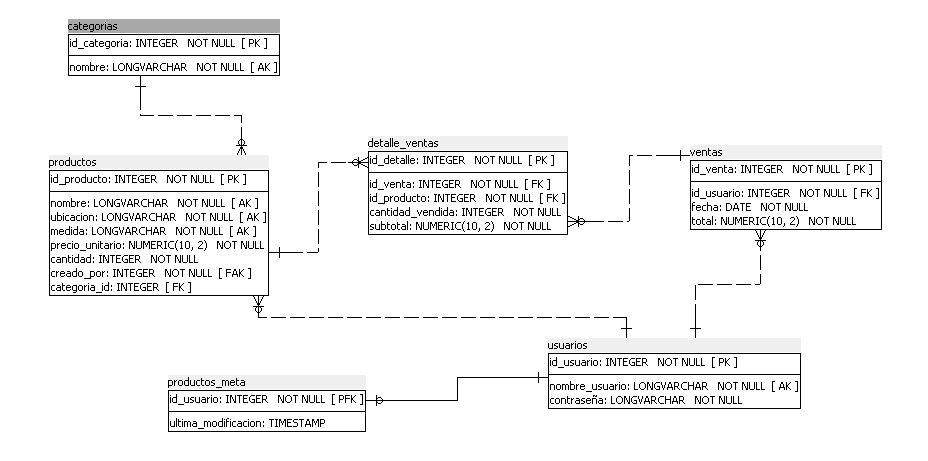
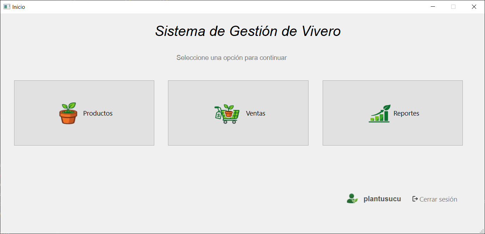
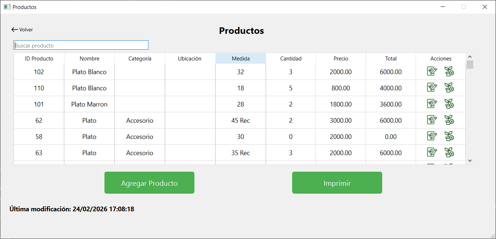
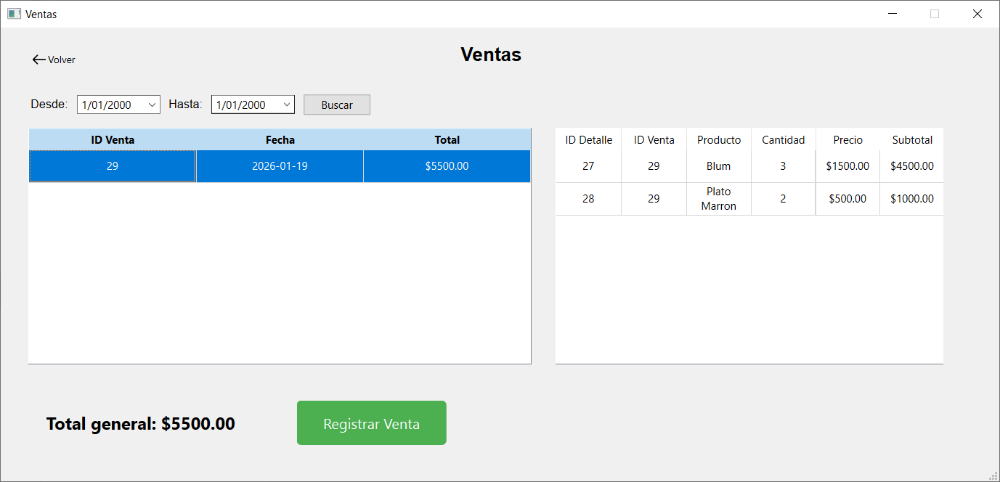
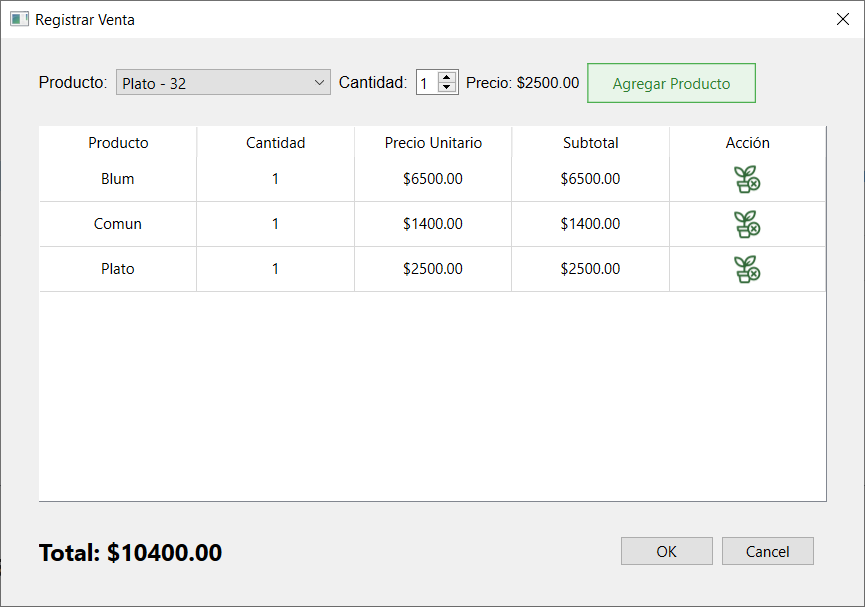
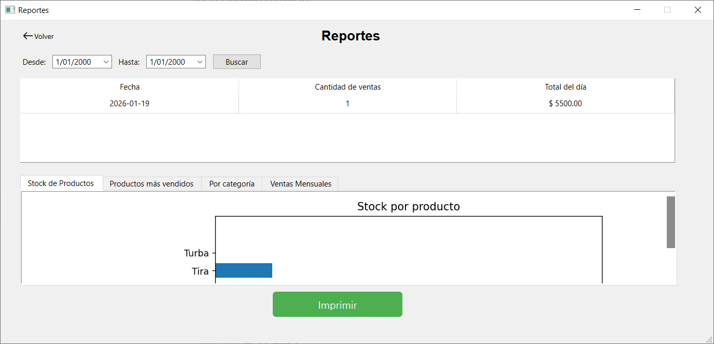
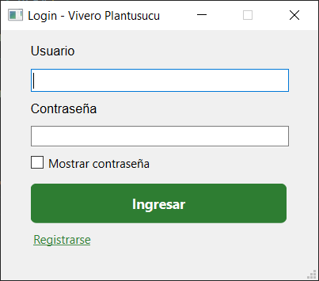

# Sistema de Gestión de Vivero  

## 1. Descripción
El presente proyecto consiste en el desarrollo de un Sistema de Gestión de Ventas que permite administrar productos, registrar ventas y generar reportes estadísticos por usuario.

El sistema fue desarrollado como aplicación de escritorio utilizando Python y una arquitectura en capas con separación mediante casos de uso.


## 2. Objetivos del Sistema
- Permitir el registro e inicio de sesión de usuarios.
- Gestionar productos y categorías.
- Registrar ventas mediante un carrito de compras.
- Generar reportes diarios y por rango de fechas.
- Mostrar gráficos estadísticos de ventas y stock.
- Mantener separación de responsabilidades mediante arquitectura limpia.


## 3. Tecnologías Utilizadas
- Lenguaje: Python 3
- Framework GUI: PyQt6
- Base de datos: PostgreSQL
- Librerías adicionales:
   - Matplotlib (para gráficos)

## 4. Arquitectura del Proyecto

El sistema está estructurado bajo una arquitectura por capas:

- UI (Interfaz gráfica)
  Ventanas, popups.

- Casos de Uso (Use Cases)
  Implementan acciones específicas del sistema.

- Servicios 
  Contienen lógica de negocio reutilizable

- Persistencia
  Repositorios responsables del acceso a datos y conexión a base de datos.

- Entidades / Dominio
  Modelos como Usuario, Producto, Venta, Carrito.

Esta separación permite:
- Mayor mantenibilidad
- Mejor organización del código
- Escalabilidad futura


## 5. Funcionalidades Implementadas
 ### Gestión de Usuarios
   - Registro de nuevos usuarios
   - Inicio de sesión
   - Asociación de datos por usuario

### Gestión de Productos
- Alta, modificación y eliminación
- Ordenado por categorías
- Control de stock

### Registro de Ventas
 - Carrito dinámico
 - Cálculo automático de subtotales y total general
 - Validación de stock
 - Eliminación de productos del carrito
 - Confirmación y persistencia de venta

 ### Reportes
 - Reporte diario
 - Búsqueda por rango de fechas
 - Gráficos de:
   - Stock por producto
   - Stock por categoría
   - Ventas mensuales
   - Productos más vendidos

## 6. Funcionamiento General del Sistema

El flujo general de uso de la aplicación es el siguiente:

### 1. Inicio de sesión
- El usuario puede registrarse creando una nueva cuenta.
- Luego puede iniciar sesión con su nombre de usuario y contraseña.
- Cada usuario gestiona únicamente sus propios productos y ventas.

### 2. Gestión de productos
- El usuario puede agregar nuevos productos al sistema.
- Es posible editar o eliminar productos existentes.
- Los productos se organizan por categorías y poseen control de stock.
- Cada producto registra información como nombre, categoría, ubicación, medida, cantidad y precio.

### 3. Registro de ventas
- El usuario puede registrar una venta mediante un carrito de compras.
- Se seleccionan productos y se especifica la cantidad a vender.
- El sistema valida automáticamente que exista stock suficiente.
- Se calcula el subtotal por producto y el total general de la venta.

### 4. Confirmación de venta
Cuando el usuario confirma la venta, el sistema:

- Registra la venta en la base de datos.
- Guarda el detalle de cada producto vendido.
- Actualiza automáticamente el stock de los productos.

### 5. Reportes
El sistema permite generar reportes de información para el usuario:

- Reporte diario de ventas.
- Búsqueda de ventas por rango de fechas.
- Visualización de gráficos estadísticos como:
  - Ventas mensuales
  - Productos más vendidos
  - Stock por producto
  - Stock por categoría

## 7. Requisitos para Ejecutar el Sistema
- Python 3.12.9 instalado
- Instalar dependencias necesarias:
```bash
pip install pyqt6 matplotlib psycopg
```
Ejecutar:
```bash
python main.py
```
## 8. Estructura del Proyecto
```bash
/app              → Punto de entrada y configuración principal
/ui               → Interfaces gráficas (ventanas y popups)
/use_cases        → Lógica de negocio desacoplada
/domain           → Entidades del sistema
/services         → Servicios de aplicación
/repositories     → Acceso a datos
/database         → Configuración y conexión a BD
/infrastructure   → Implementaciones técnicas externas (como gráficos)
/validators       → Validaciones de formularios y reglas
/exceptions       → Excepciones personalizadas
/resources        → Íconos y archivos estáticos
/docs             → Documentación y capturas
/tests            → Pruebas unitarias
```

## 9. Pruebas Realizadas
- Pruebas de registro y login.
- Validación de errores en formularios.
- Pruebas con usuario sin datos.
- Validación de reportes vacíos.
- Verificación de cálculos monetarios.
- Pruebas de consistencia visual en tablas.


## 10. Estado Final del Proyecto

El sistema se encuentra:

- ✔ Funcional
- ✔ Estable
- ✔ Con validaciones implementadas
- ✔ Con mejoras de consistencia visual


## 11. Modelo Entidad–Relación




## 12. Capturas de Pantalla

### Inicio


### Productos


### Ventas


### Registrar Venta


### Reportes


### Login
