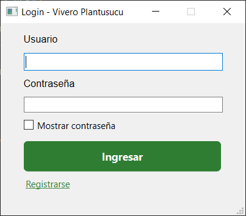
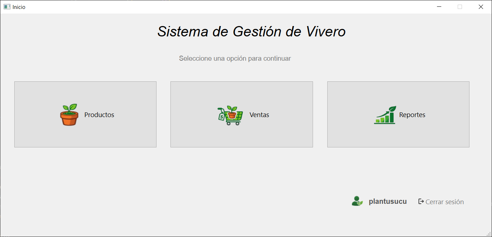
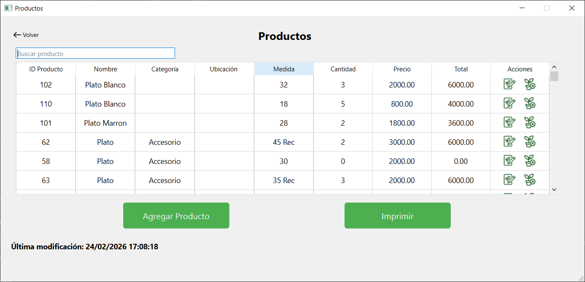
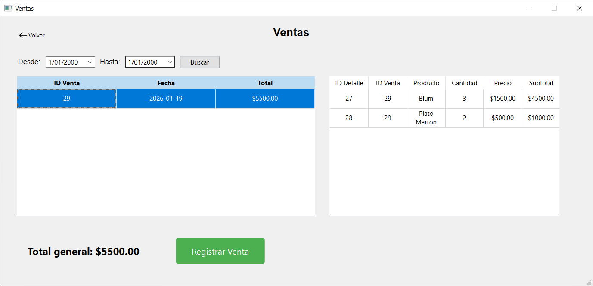
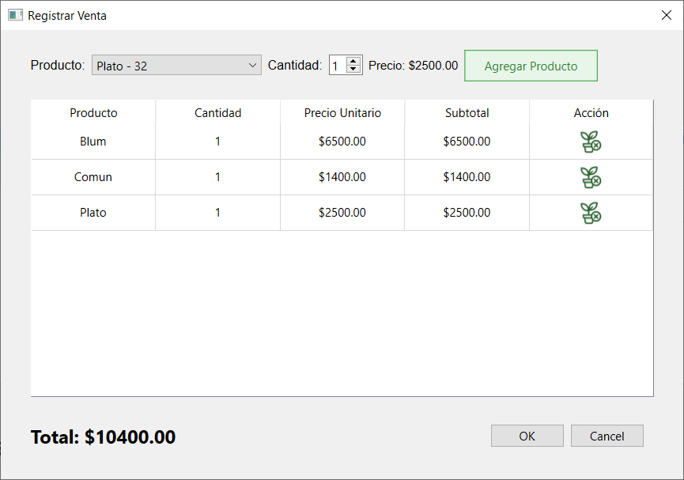
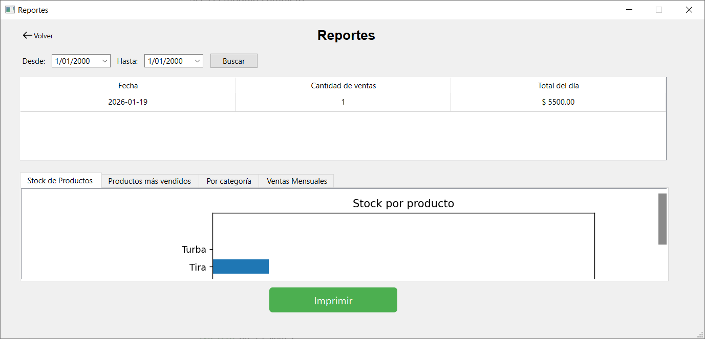

# Sistema de Gestión de Vivero  

Aplicación de escritorio desarrollada en Python con PyQt6 para la gestión de productos, ventas y reportes, utilizando PostgreSQL como base de datos.

---

## 📸 Vista previa

### Login


### Inicio


### Productos


### Ventas


### Registrar Venta


### Reportes


---

## 🚀 Funcionalidades principales

- Gestión de productos y categorías (CRUD)
- Sistema de ventas tipo carrito
- Control automático de stock
- Registro de ventas con múltiples productos
- Reportes por fecha y estadísticas
- Gráficos de ventas y stock
  
---

## 🧠 Arquitectura y diseño

- Arquitectura en capas (UI, Use Cases, Repositorios)
- Aplicación de principios SOLID
- Separación de lógica de negocio y persistencia
- Validaciones desacopladas mediante validators
- Uso de excepciones personalizadas

---

## ⚙️ Tecnologías utilizadas

- Python 3
- PyQt6
- PostgreSQL
- Matplotlib

---

## ▶️ Cómo ejecutar el proyecto

```bash
pip install pyqt6 matplotlib psycopg
python main.py
```

---

## 🧩 Estructura del Proyecto
```bash
/app              → Punto de entrada y configuración principal
/ui               → Interfaces gráficas (ventanas y popups)
/use_cases        → Lógica de negocio desacoplada
/domain           → Entidades del sistema
/services         → Servicios de aplicación
/repositories     → Acceso a datos
/database         → Configuración y conexión a BD
/infrastructure   → Implementaciones técnicas externas (como gráficos)
/validators       → Validaciones de formularios y reglas
/exceptions       → Excepciones personalizadas
/resources        → Íconos y archivos estáticos
/docs             → Documentación y capturas
/tests            → Pruebas unitarias
```
