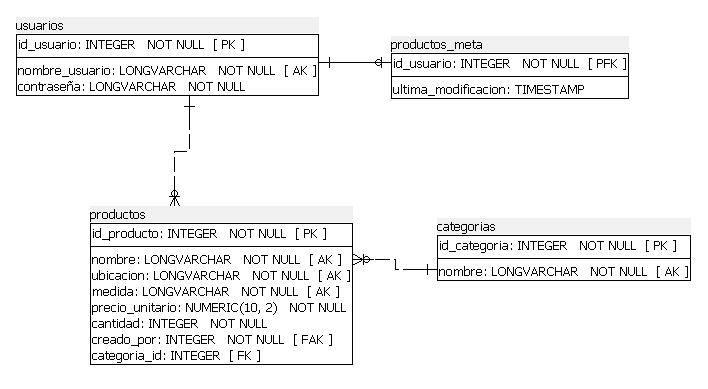

# Gestión de Inventario de un Vivero  
### Proyecto de Prácticas Profesionales Supervisadas (PPS) – 1° Etapa  
**Universidad Tecnológica Nacional (UTN) – C.U.V.L. – T.U.S.I.**  
**Autor:** Francisco Antonelli  
**Año:** 2025  

---

## Descripción

El proyecto consiste en desarrollar un sistema de inventario para un vivero que comercializa plantas y productos relacionados (macetas, tierra, insumos, etc.).  
Esta primera entrega está enfocada en el **registro de productos**, permitiendo guardar atributos específicos como:

- Nombre  
- Categoría  
- Ubicación  
- Medida  
- Precio  
- Cantidad disponible  

Además, registra internamente **la última modificación realizada por cada usuario** sobre los productos.

---

## Justificación

El emprendimiento familiar actualmente gestiona su inventario de forma manual, lo que genera errores y desorganización.  
Este sistema busca iniciar la **digitalización del negocio**, mejorando el control y la trazabilidad de los productos.

---

## Objetivos

1. Facilitar el registro y la organización de productos del vivero.  
2. Garantizar la integridad y consistencia de los datos registrados.  
3. Crear una interfaz amigable y accesible.  
4. Implementar un sistema de login simple para proteger el acceso.  
5. Registrar la fecha y hora de la última modificación para control y trazabilidad.  

---

## Destinatario

Emprendedores o pequeños viveros que desean comenzar a digitalizar la gestión de su inventario de manera **simple, accesible y escalable**.

---

## Alcance

- **Registro de productos** con datos como nombre, categoría, ubicación, medida, precio y cantidad.  
- **Validaciones** de entrada:  
  - Campos obligatorios  
  - Números positivos  
  - Manejo de valores `None` cuando no aplique ubicación o medida  
- **Login básico** (usuario y contraseña)  
- **Conexión a base de datos PostgreSQL**  
- **Mensajes de error o confirmación** según el resultado del guardado  

---

## Flujo de trabajo

1. **Inicio de sesión:** el usuario ingresa con credenciales válidas.  
2. **Acceso al registro de productos:** tras el login, se accede a la pantalla principal.  
3. **Carga de producto:** se ingresan los datos del producto.  
4. **Validación automática:** se verifica el formato y obligatoriedad de los campos.  
5. **Confirmar y guardar:** se registra el producto o se muestran errores.  
6. **Modificación:** se actualiza la fecha y hora de la última modificación al editar o eliminar.  

---

## Exclusiones del Proyecto

No se incluyen en esta etapa:

- Gestión de ventas  
- Reportes gráficos o estadísticas  
- Login con roles o permisos avanzados  
- Gestión de clientes o proveedores  

---

## Beneficios Esperados

- Digitalización completa del inventario  
- Reducción de errores manuales  
- Organización eficiente  
- Base escalable para futuras mejoras  
- Acceso controlado mediante login  
- Validaciones desacopladas y robustas  
- Mayor confiabilidad gracias a pruebas unitarias  

---

## Investigación e Inconvenientes

### Investigación
- Bibliotecas gráficas (PyQt6)  
- Estructura de base de datos  
- Validación de formularios  

### Inconvenientes
- Algunos productos no requieren ubicación o medida → se permite `None`  
- Cambios en la estructura podrían requerir rediseño  
- Posibles dificultades de uso para usuarios no técnicos  

---

## Planificación

| Fase                  | Actividad                                                        | Inicio      | Fin         |
|------------------------|------------------------------------------------------------------|-------------|-------------|
| Etapa de Análisis      | Definición de requerimientos                                    | 06/01/2025  | 10/01/2025  |
|                        | Diseño de base de datos y atributos                             | 11/01/2025  | 15/01/2025  |
| Diseño del Sistema     | Creación del modelo de base de datos                            | 16/01/2025  | 22/01/2025  |
|                        | Diseño de interfaz gráfica                                      | 23/01/2025  | 30/01/2025  |
| Desarrollo del Sistema | Backend en Python + PostgreSQL (gestión básica de inventario)   | 31/01/2025  | 09/03/2025  |
|                        | Desarrollo de interfaz gráfica (formularios)                    | 10/03/2025  | 31/03/2025  |
| Pruebas y Ajustes      | Validación con datos reales y ajustes                           | 16/04/2025  | 15/07/2025  |
| Ajustes finales        | Retoques finales del sistema                                    | 16/06/2025  | 22/07/2025  |

---

## Desarrollo

- **Lenguaje:** Python 3  
- **Base de datos:** PostgreSQL  
- **Interfaz gráfica:** PyQt6  
- **Conexión BD:** psycopg  
- **Arquitectura:** Principios SOLID  
- **Validadores desacoplados**  
- **Pruebas unitarias:** para servicios y validadores  

---

## Modelo Entidad–Relación

---

## Conclusión

El sistema establece una base sólida para digitalizar el control de inventario de un vivero familiar.  
Permite registrar productos de forma ordenada y confiable, reduce errores y mejora la trazabilidad.  
Su arquitectura modular y el uso de validadores independientes facilitan futuras expansiones (ventas, reportes, usuarios, etc.).

---

## Registro de Cambios

| Fecha       | Versión | Cambios realizados |
|-------------|----------|--------------------|
| 13/10/2025  | 1.5 | Implementación de validadores desacoplados y pruebas unitarias |
| 21/07/2025  | 1.4 | Se agregó la tabla `productos_meta` para registrar la última modificación por usuario |
| 19/07/2025  | 1.3 | Login básico y validadores según principios SOLID |
| 10/06/2025  | 1.2 | Alcance reducido centrado en registro de productos |
| 29/03/2025  | 1.1 | Se agregó la sección “Justificación” |
| 29/03/2025  | 1.0 | Documento inicial |

---

## Capturas de Pantalla

### Login

### Gestión de Productos

### Agregar Producto

### Editar Producto

---

© 2025 – *Francisco Antonelli*