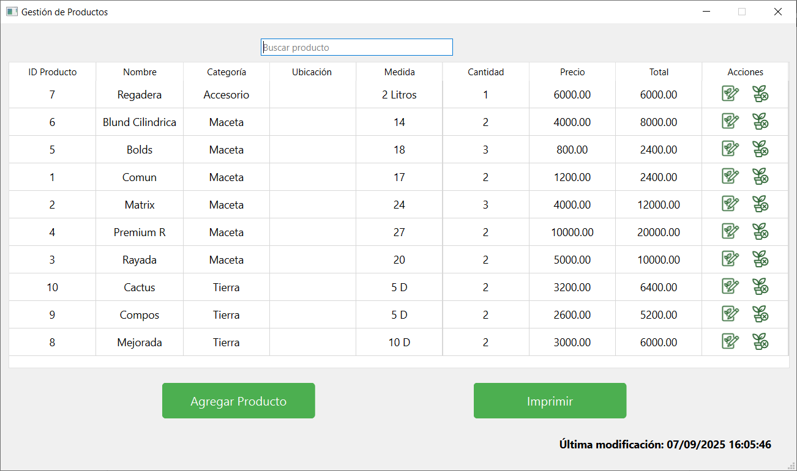

# Sistema de Gestión de Vivero  

## 1. Descripción
El presente proyecto consiste en el desarrollo de un Sistema de Gestión de Ventas que permite administrar productos, registrar ventas y generar reportes estadísticos por usuario.

El sistema fue desarrollado como aplicación de escritorio utilizando Python y una arquitectura basada en casos de uso.


## 2. Objetivos del Sistema
- Permitir el registro e inicio de sesión de usuarios.
- Gestionar productos y categorías.
- Registrar ventas mediante un carrito de compras.
- Generar reportes diarios y por rango de fechas.
- Mostrar gráficos estadísticos de ventas y stock.
- Mantener separación de responsabilidades mediante arquitectura limpia.


## 3. Tecnologías Utilizadas
- Lenguaje: Python 3
- Framework GUI: PyQt6
- Base de datos: PostgreSQL
- Librerías adicionales:
   - Matplotlib (para gráficos)

## 4. Arquitectura del Proyecto

El sistema está estructurado bajo una arquitectura por capas:

- UI (Interfaz gráfica)
  Ventanas, popups.

- Casos de Uso (Use Cases)
  Lógica de negocio desacoplada de la interfaz.

- Entidades / Dominio
  Modelos como Usuario, Producto, Venta, Carrito.

- Persistencia
  Repositorios responsables del acceso a datos y conexión a base de datos.

Esta separación permite:
- Mayor mantenibilidad
- Mejor organización del código
- Escalabilidad futura


## 5. Funcionalidades Implementadas
 ### Gestión de Usuarios
   - Registro de nuevos usuarios
   - Inicio de sesión
   - Asociación de datos por usuario

### Gestión de Productos
- Alta, modificación y eliminación
- Ordenado por categorías
- Control de stock

### Registro de Ventas
 - Carrito dinámico
 - Cálculo automático de subtotales y total general
 - Validación de stock
 - Eliminación de productos del carrito
 - Confirmación y persistencia de venta

 ### Reportes
 - Reporte diario
 - Búsqueda por rango de fechas
 - Gráficos de:
   - Stock por producto
   - Stock por categoría
   - Ventas mensuales
   - Productos más vendidos

## 6. Requisitos para Ejecutar el Sistema
- Python 3.12.9 instalado
- Instalar dependencias necesarias:
```bash
pip install pyqt6 matplotlib psycopg
```
Ejecutar:
```bash
python main.py
```
## 7. Estructura del Proyecto
```bash
/app              → Punto de entrada y configuración principal
/ui               → Interfaces gráficas (ventanas y popups)
/use_cases        → Lógica de negocio desacoplada
/domain           → Entidades del sistema
/services         → Servicios de aplicación
/repositories     → Acceso a datos
/database         → Configuración y conexión a BD
/infrastructure   → Implementaciones técnicas externas (como gráficos)
/validators       → Validaciones de formularios y reglas
/exceptions       → Excepciones personalizadas
/resources        → Íconos y archivos estáticos
/docs             → Documentación y capturas
/tests            → Pruebas unitarias
```

## 8. Pruebas Realizadas
- Pruebas de registro y login.
- Validación de errores en formularios.
- Pruebas con usuario sin datos.
- Validación de reportes vacíos.
- Verificación de cálculos monetarios.
- Pruebas de consistencia visual en tablas.


## 9. Estado Final del Proyecto

El sistema se encuentra:

- ✔ Funcional
- ✔ Estable
- ✔ Con validaciones implementadas
- ✔ Con mejoras de consistencia visual


## 10. Modelo Entidad–Relación


## 11. Capturas de Pantalla

### Inicio


### Productos


### Ventas


### Registrar Venta


### Reportes


### Login
