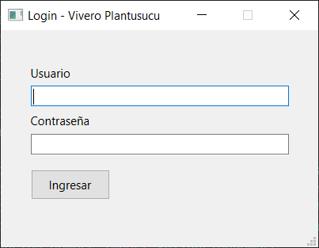

# Gestión de Inventario de un Vivero  
### Proyecto de Prácticas Profesionales Supervisadas (PPS) – 1° Etapa  
**Universidad Tecnológica Nacional (UTN) – C.U.V.L. – T.U.S.I.**  
**Autor:** Francisco Antonelli  
**Año:** 2025  

---

## Descripción

El proyecto tiene como objetivo desarrollar un sistema de inventario para un vivero que vende plantas y otros productos relacionados, como macetas, tierra y distintos insumos.  
En esta primera etapa, el trabajo se centra en el **registro de productos**, guardando información como:

- Nombre  
- Categoría  
- Ubicación  
- Medida  
- Precio  
- Cantidad disponible  

Además, el sistema lleva un registro interno de **la última modificación realizada por cada usuario** sobre los productos.

---

## Justificación

El emprendimiento familiar actualmente gestiona su inventario de forma manual, lo que puede generar errores y dificultades en el control de productos.  
Este sistema busca iniciar una **transformación tecnológica**, con un registro digital fiable y ordenado de los productos.

---

## Objetivos

1. Facilitar el registro y la organización de productos en el inventario del vivero.  
2. Garantizar la integridad y consistencia de los datos registrados.  
3. Crear una interfaz amigable que permita a los usuarios registrar productos fácilmente.  
4. Implementar un sistema de login simple para proteger el acceso al inventario.  
5. Registrar la fecha y hora de la última modificación de productos por usuario, para control y trazabilidad.

---

## Destinatario

Emprendedores de viveros que necesiten comenzar a digitalizar la gestión de su inventario, con un enfoque **simple, accesible y escalable**.

---

## Alcance

1. **Registro de productos** con información como:  
   - Nombre  
   - Categoría (Planta, Maceta, Tierra, Otro)  
   - Ubicación (“Interior”, “Exterior” o “Ambas”)  
   - Medida (si aplica)  
   - Precio y cantidad  

2. **Validación de datos** ingresados:  
   - Valores positivos  
   - Campos obligatorios  
   - Conversión de números desde texto  
   - Permitir `None` en ubicación o medida si no aplican  

3. **Login básico** por usuario (usuario/contraseña)  

4. **Almacenamiento en base de datos PostgreSQL**  

5. **Mensajes de confirmación o error** según el caso  

---

## Flujo de trabajo

1. **Iniciar registro**  
   - Responsable: Usuario  
   - Acción: Ingresar al sistema mediante login mínimo  
   - Validación: Verificación de credenciales con mensajes de error si son incorrectas  

2. **Acceder al registro de productos**  
   - Acción: Acceder a la pantalla principal luego del login  

3. **Cargar información del producto**  
   - Nombre  
   - Ubicación sugerida (Interior / Exterior / Ambas)  
   - Medida (si corresponde)  
   - Precio unitario  
   - Cantidad en stock  
   - Categoría  

4. **Validación automática**  
   - Verificación de campos obligatorios  
   - Validación de formato (números, medida, etc.)  

5. **Confirmar y guardar**  
   - Acción: Botón “Guardar producto”  
   - Resultado: Registro exitoso o mensaje de error  

6. **Registrar modificación**  
   - Acción: Cada vez que un usuario agrega, edita o elimina un producto, se actualiza la fecha y hora de su última modificación  
   - Resultado: Registro automático en la base de datos para trazabilidad  

---

## Exclusiones del Proyecto

Esta primera etapa **no incluye**:

- Gestión de ventas  
- Generación de reportes gráficos o estadísticas  
- Login con múltiples roles o permisos avanzados  
- Gestión de clientes o proveedores  

---

## Beneficios Esperados

- Digitalización del control de inventario  
- Reducción de errores por registros manuales  
- Mejora en la organización de productos  
- Base escalable para futuras funciones  
- Control de acceso mediante autenticación básica  
- Validación robusta de datos con principios SOLID  
- Mayor confiabilidad gracias a pruebas unitarias  

---

## Investigación e Inconvenientes

### Investigación

- Evaluación de bibliotecas gráficas  
- Diseño de estructura de base de datos  
- Validación de formularios  

### Inconvenientes

- Algunos productos no requieren ubicación o medida → se permite `None`  
- Cambios en la estructura del inventario podrían requerir rediseño  
- Posibles dificultades de uso para usuarios no técnicos  

---

## Planificación

| Fase                  | Actividad                                                        | Fecha de Inicio | Fecha de Término |
|------------------------|-----------------------------------------------------------------|----------------|----------------|
| Etapa de Análisis      | Definición de requerimientos                                     | 06/01/2025     | 10/01/2025     |
|                        | Diseño de la base de datos y atributos                            | 11/01/2025     | 15/01/2025     |
| Diseño del Sistema     | Creación del modelo de base de datos                               | 16/01/2025     | 22/01/2025     |
|                        | Diseño de la interfaz gráfica                                     | 23/01/2025     | 30/01/2025     |
| Desarrollo del Sistema | Backend en Python con PostgreSQL (gestión básica de inventario)    | 31/01/2025     | 09/03/2025     |
|                        | Desarrollo de interfaz gráfica (formularios)                       | 10/03/2025     | 31/03/2025     |
| Pruebas y Ajustes      | Validación con datos reales y ajustes en el sistema               | 16/04/2025     | 15/07/2025     |
| Ajustes finales        | Retoques finales del sistema                                       | 16/06/2025     | 22/07/2025     |

---

## Desarrollo

- **Lenguaje de Programación:** Python 3  
- **Base de Datos:** PostgreSQL  
- **Interfaz Gráfica:** PyQt6  
- **Conexión a BD:** psycopg  
- **Pantalla principal:** Registro de productos  
- **Validadores:** Desacoplados según principios SOLID  
- **Pruebas unitarias** implementadas para servicios y validadores  

---

## Modelo Entidad–Relación

---

## Conclusión

El sistema proporciona una base funcional para comenzar la digitalización del vivero familiar.  
Permite registrar productos con sus atributos clave de manera ordenada, reduciendo errores y mejorando la organización del inventario.  
Incluye un sistema de login para garantizar acceso controlado y la gestión de categorías independientes, lo que lo hace robusto y preparado para futuras funcionalidades.

---

## Registro de Cambios

| Fecha       | Versión | Cambios realizados |
|------------|---------|------------------|
| 13/10/2025 | 1.5     | Implementación de validadores desacoplados, pruebas unitarias |
| 21/07/2025 | 1.4     | Incorporación de tabla `productos_meta` para registrar última modificación por usuario |
| 19/07/2025 | 1.3     | Login básico de usuario, gestión de categorías y validadores desacoplados según SOLID |
| 10/06/2025 | 1.2     | Documento adaptado para entrega parcial centrada en registro de productos |
| 29/03/2025 | 1.1     | Se agregó sección "Justificación" |
| 29/03/2025 | 1.0     | Documento inicial |

---

## Capturas de Pantalla

### Login

### Gestión de Productos

### Agregar Producto

### Editar Producto

---

© 2025 – *Francisco Antonelli*